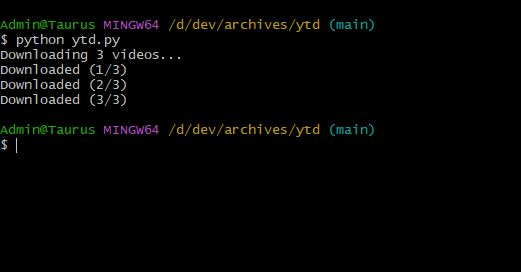

# Youtube Downloader

This is a light-weight youtube downloader script. To run, just put all the youtube
viseo links in the `links.txt` file and run the following command. 

```shell
$ python ytd.py
```

Note that this
script requires [pytube](https://pypi.org/project/pytube/7.0.16/). Install it using
pip install command




You will see the downloaded files in the `downloads/` folder
